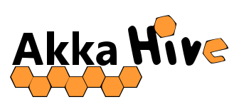
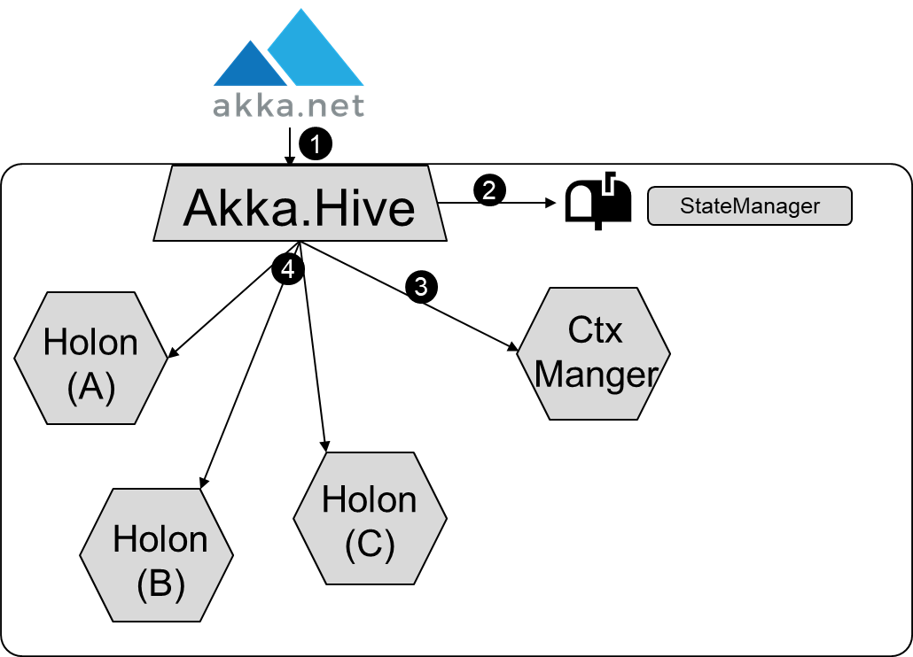
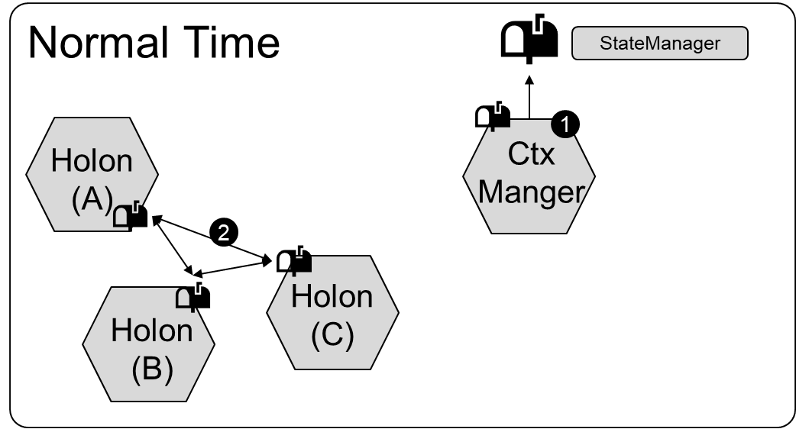
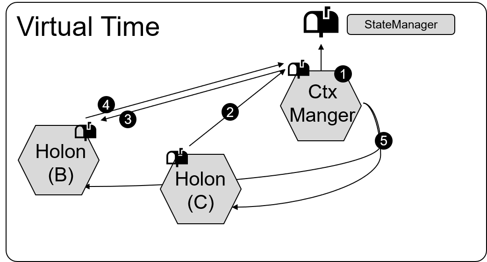

 

# Welcome
## Initialization 
<table>
    <tr>
        <td>
             
            <ol>
                <li>Initializing of Akka Hive</li>
                <li>Initializing a Mailbox to comunicate with the hive residents </li>
                <li>Create a context manager</li>
                <li>Create the Hive residents</li>
            </ol>
        </td>
        <td width="350">
            
        </td>
    </tr>
</table>

## Execution with normal time 
<table>
    <tr>
        <td>
        Each hive resident has its own mailbox and is able to receive messages, according to the rules of Akka. For nomal Execution the...
            <ol>
                <li>... context manager send regulary bounce for periodic task execution</li>
                <li>... Holons themself can comunicate directly without any changes, by using "Send(..)" method. In addition the holon sets the local time before a message is processed to keep the time static through the complete processing time.</li>
            </ol>
        </td>
        <td width="350" >
            
        </td>
    </tr>
</table>

## Execution with virtual time 
<table>
    <tr>
        <td>
        
To enable the hive to pass the time more quickly, all messages are routed over the context manager that keeps track of all activies for the current point in time.

             <ol>
                <li>The Context manager stops the simulation after a given time "InterruptInterval" and sends a "Stop" message to the State Manager. The State Manager can now Collect and analyze the hive and resume the Simulation. Of course the Interval can be set to Zero and no intervall will occure.</li>
                <li>All comunication beween holons are automaticaly routed to the Context manager, by using "Send(..)", there is no need to change method calls. </li>
                <li>The context manager incements the internal message counter for messages that shall be processed. Alternatively it incements a future message counter if the message shall be delayed. By calling "Send(message, delay)"</li>
                <li>After the Holon proceeded a message the holon sends an processing aknowledgement to the context manager.</li>
                <li>If all messages for the current time are processed the context manager Broadcasts a "AdvanceTo" to the next point in time where messages can be processed. All holons release the messages for the new time and proceed processing.</li>
            </ol>
        </td>
        <td width="350" >
            
        </td>
    </tr>
</table>
